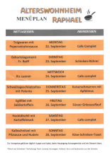
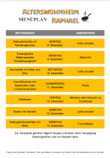

# Readme

Typst is still pretty new to me. At first I just tried to recreate the giving layout of the old solution. But later I got curious if I can recreated more complicate designs.

## Raphael

"Alterswohnheim Raphael" used a Word file with tables to create the weekly menu printout. I received the original Docx file. Opening the file with Libreoffice Writer was useless as the layout in Libreoffice Writer was significantly different compared to Word. I asked to get a printed version and used that to model the layout.

[](raphael/spec/Menüplan_scan.pdf)

_The image are linked to the PDF_

The yellow colors turned orange with this scanner. So the Docx file was still useful to the extract the correct color codes.

The egui application uses a INI file to store the data. Typst can read TOML data which is very similar. I am also use alternative datasets to see how much data can fit on a single page.

[](raphael/wochenmenu.pdf)

## Two-column layout

I invested some time to see how other menu cards are designed. I found a [two-column menu card design on pinterest](https://ch.pinterest.com/pin/521854675593920037/). I applied the same data to show the overview of one week.

## Further Tools

The `watch.sh` starts a `typst watch` with the correct resources and will automatically compiles a new PDF file upon changing the TYP-file or the menu.ini.

To create a thumbnail-sized preview:
```bash
typst compile -f png --ppi=40 --font-path . two-column.typ two-column.png
```
 
To reorder pages in a PDF:
```bash
sudo pacman -S pdftk
pdftk '2025-09-22 Menüplan Alterswohnheim Raphael.pdf'  cat 1-3 5 4 output Menuüplan_scan.pdf
```

### Markdown Syntax
Linking resources with a image instead of alt-text: https://stackoverflow.com/a/61072867/406423